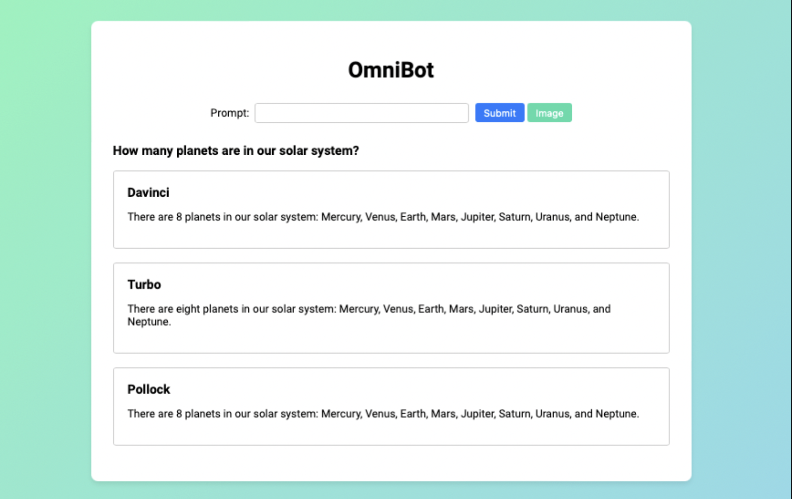
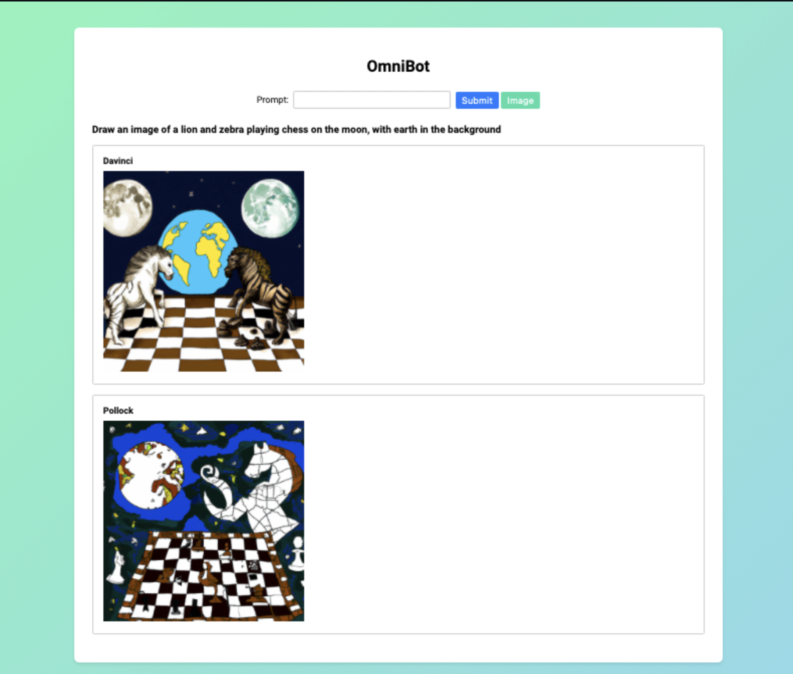

# COMP30220 Team Omni
This project is a distributed system that is designed to provide the user with response from four different models of ChatGPT when the user enters a prompt. The user can decide if they want to submit the prompt to get a text or an image response.

### link to the video showcasing the project: https://gitlab.com/ucd-cs-rem/comp30220-2023/omni/-/blob/main/Omni-Video-presentation.mp4

### link to the report: https://gitlab.com/ucd-cs-rem/comp30220-2023/omni/-/blob/main/Omni_Report.docx

## Setup
### Prerequisites
- Java 8
- Maven
- Docker
- minikube

### Starting Omni
This project run in docker and Kubernetes. If you want to run it in Kubernetes, you will need to have minikube installed and docker running in the background if you are running it locally. `run.bat` and `run.sh` will start the project in docker. `run_kube.bat` and `run_kube.sh` will start the project in Kubernetes.

**IMPORTANT**
Before running the batch/shell scripts, make sure that the `api-keys.txt` file is filled in with the correct API keys. The file should be in the root directory of the project.

#### On Linux/Mac
`bash run.sh` will start the project in docker. `bash run_kube.sh` will start the project in Kubernetes.

#### On Windows
`run.bat` will start the project in docker. `run_kube.bat` will start the project in Kubernetes.

### Opening the web client

If using `run.sh` or `run.bat`. Go to the web interface at: `http://localhost:8085/`

If `run_kube.bat` or `run_kube.sh` was used, the command-prompt/terminal will output the address of the web client and in most cases will automatically open the web-client in the browser.

## Team Members
- Dawid Skraba
- Ruben Ewout van Breda
- Oisin Mc Menamin
- Kamil Michalski